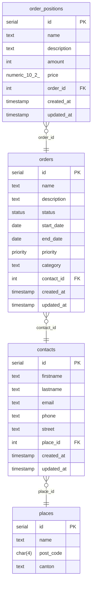

# Projekt 295: Auftragsmanagementsystem

## Beschreibung

Dies soll ein kleines Tool werden, wo man diverse Aufträge, wie Webseiten, Apps, IT-Service, Therapie, etc. verwalten
kann. Fürs erste soll es eine einfache CRUD-App bleiben, könnte aber später auch mit Features, wie Rechnungsgenerierung,
Buchhaltung, etc. erweitert werden.

## Datenmodell

### Zusammenfassung

- [Entities](#entities)
    - [places](#places)
    - [contacts](#contacts)
    - [orders](#orders)
    - [order_positions](#order_positions)
- [Types](#types)
    - [status](#status)
    - [priority](#priority)
- [Diagram](#diagram)

### Entities

#### places

| Attribute     | Type    | Properties | Reference | Documentation |
|---------------|---------|------------|-----------|---------------|
| **id**        | serial  | PK         |           |               |
| **name**      | text    |            |           |               |
| **post_code** | char(4) |            |           |               |
| **canton**    | text    |            |           |               |

#### contacts

| Attribute      | Type      | Properties | Reference | Documentation |
|----------------|-----------|------------|-----------|---------------|
| **id**         | serial    | PK         |           |               |
| **firstname**  | text      |            |           |               |
| **lastname**   | text      |            |           |               |
| **email**      | text      |            |           |               |
| **phone**      | text      |            |           |               |
| **street**     | text      |            |           |               |
| **place_id**   | int       |            | places.id |               |
| **created_at** | timestamp |            |           |               |
| **updated_at** | timestamp |            |           |               |

#### orders

| Attribute       | Type      | Properties | Reference   | Documentation |
|-----------------|-----------|------------|-------------|---------------|
| **id**          | serial    | PK         |             |               |
| **name**        | text      |            |             |               |
| **description** | text      |            |             |               |
| **status**      | status    |            |             |               |
| **start_date**  | date      |            |             |               |
| **end_date**    | date      |            |             |               |
| **priority**    | priority  |            |             |               |
| **category**    | text      |            |             |               |
| **contact_id**  | int       |            | contacts.id |               |
| **created_at**  | timestamp |            |             |               |
| **updated_at**  | timestamp |            |             |               |

#### order_positions

| Attribute       | Type          | Properties | Reference | Documentation |
|-----------------|---------------|------------|-----------|---------------|
| **id**          | serial        | PK         |           |               |
| **name**        | text          |            |           |               |
| **description** | text          | nullable   |           |               |
| **amount**      | int           |            |           |               |
| **price**       | numeric(10,2) |            |           |               |
| **order_id**    | int           |            | orders.id |               |
| **created_at**  | timestamp     |            |           |               |
| **updated_at**  | timestamp     |            |           |               |

### Types

#### status

ENUM: open, in_progress, finished, cancelled

#### priority

ENUM: low, medium, high

### Diagram

## Credentials

Alle Dienste (Postgres & Keycloak) haben jeweils die folgenden Credentials:

- Username: admin
- Password: secret

## Datenbanksetup

Die Datenbank kann entweder über die beigelegte `docker-compose.yml` mit Keycloak zusammen gestartet werden.

Falls eine andere Datenbank verwendet wird müssen im `application.yml` noch die URL und Credentials angepasst werden.

## Keycloak

Keycloak wird auch über `docker-compose.yml` aufgesetzt. Der Realm wird hier von `keycloak/realm-export.json` importiert.

Falls die Keycloak Daten auch in Postgres gespeichert werden sollen, muss man noch eine seperate Datenbank anlegen.
Der Befehl dafür ist in `db/seed.sql` dokumentiert. Dies ist komplett optional, bei einem manuellen Setup.

### Nutzer & Rollen

Die App hat insgesamt 4 Nutzer und 3 Rollen für Tests. Alle Nutzer und Rollen sind im `order_manager_api` Client angelegt.

#### Rollen

- ROLE_read
- ROLE_update
- ROLE_admin

#### Nutzer 1

- Username: test
- Passwort: test
- Rollen: keine

#### Nutzer 2

- Username: read
- Passwort: test
- Rollen: ROLE_read

#### Nutzer 3

- Username: update
- Passwort: test
- Rollen: ROLE_update
- 
#### Nutzer 4

- Username: test_admin
- Passwort: test
- Rollen: ROLE_admin
